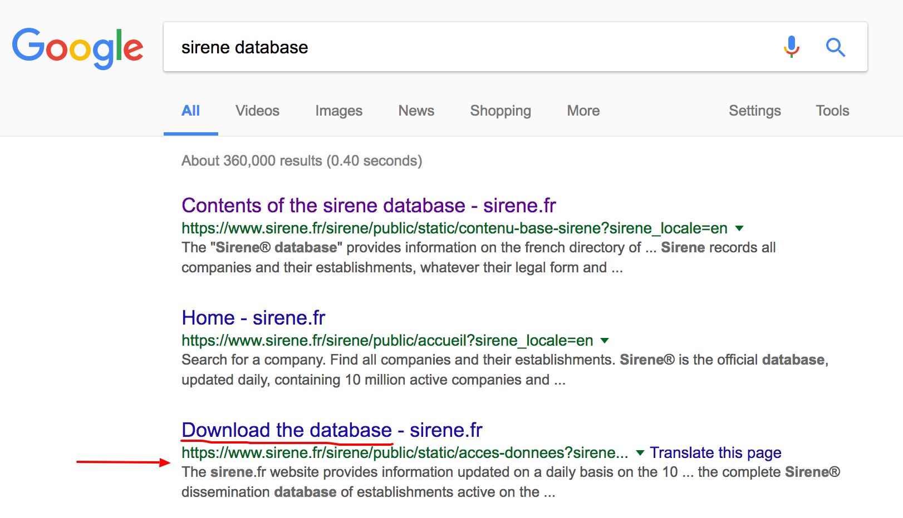
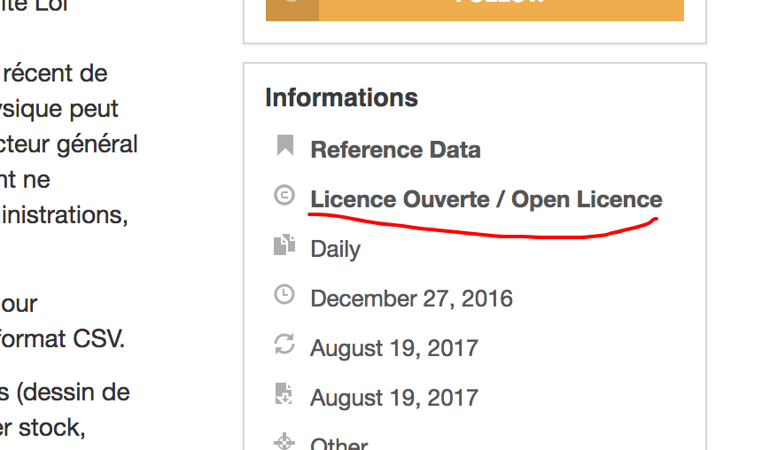
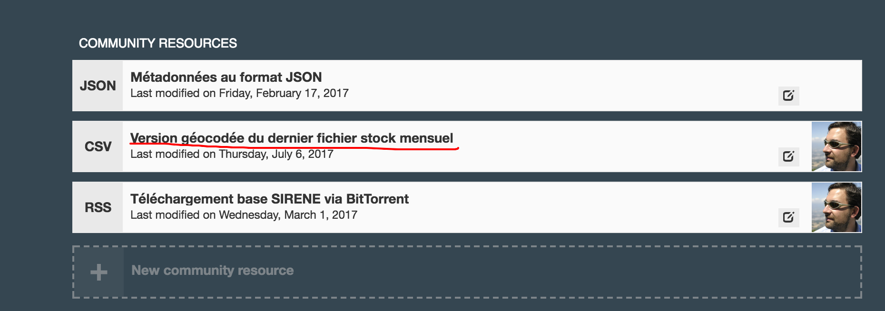

# Entretien avec Tom Forth

## Présentation

Tom a récemment publié une étude intitulée "[Measuring tech in the UK and France in 10 steps](http://tomforth.co.uk/measuringtech/)" (en anglais). 

Tom a co-fondé la société [Imactivate](http://imactivate.com/) il y a désormais 5 ans. Elle est composée de 2 personnes, est basée à Leeds et se focalise sur du logiciel et de l'analyse de données.

À ce titre, il fait partie des membres d'[ODI Leeds](https://odileeds.org/), une branche de l'[Open Data Institute](https://theodi.org/) gérée sous licence par des entreprises partenaires.

Tom parle français et a étudié pendant une année à Paris.

## Thématique • Découverte des données

Deux jeux de données ont été principalement été utilisés dans le cadre de la compréhension économique des entreprises en France :

- 🔗 "[Base Sirene des entreprises et de leurs établissements (SIREN, SIRET)
](https://www.data.gouv.fr/fr/datasets/base-sirene-des-entreprises-et-de-leurs-etablissements-siren-siret/)"
- 🔗 "[BAN - Base Adresse Nationale](https://www.data.gouv.fr/fr/datasets/ban-base-adresse-nationale/)"

> J'ai découvert la Base Adresse Nationale via un [tweet d'Axelle Lemaire](https://twitter.com/axellelemaire/status/807189008023453696). Elle est très vocale sur Twitter.

---

🗣 Je cherchais la **liste des entreprises françaises** sur Google:

🔍 "[french companies database](https://www.google.co.uk/search?q=french+companies+database)"

1. Scan de la liste des résultats
1. 👉 "[List of company registers](https://en.wikipedia.org/wiki/List_of_company_registers#France)"   

1. 🔍 Recherche Google pour "[sirene database](http://google.co.uk/search?q=sirene%20database)"  

1. 👉 "[Download the Sirene database](https://www.sirene.fr/sirene/public/static/acces-donnees?sirene_locale=en)"    
1. 👉 "[data-gouv](https://www.data.gouv.fr/en/datasets/base-sirene-des-entreprises-et-de-leurs-etablissements-siren-siret/)"     

1.   🔗 "[Base Sirene des entreprises et de leurs établissements (SIREN, SIRET)](https://www.data.gouv.fr/en/datasets/base-sirene-des-entreprises-et-de-leurs-etablissements-siren-siret/)"  
🗣 Identification de la mise à jour mensuelle  
C'est plus facile à traiter et c'était **suffisant en terme de précision de données**.

> Lorsque je renouvelle mes recherches, **je vais sur le site officiel de la base SIRENE** car c'est là que **se trouve la documentation**.

---

🗣 Je cherche de temps en temps du côté des [données SNCF](https://ressources.data.sncf.com/explore/?sort=modified) ou de l'[API SNCF](https://data.sncf.com/api). 

---

🗣 Je regarde aussi du côté du [portail Open Data de Rennes Métropole](https://data.rennesmetropole.fr/). Notamment quand je travaille avec eux.

---

🤔 Je me souviens avoir été sur [data.gouv.fr](https://www.data.gouv.fr/en/) pour récupérer des données liées aux élections.

😤 À ce moment là, les téléchargements étaient lents.

💬 Je suis donc allé les récupérer directement du côté de chez [OpenDataSoft](https://www.opendatasoft.com/) — je connais quelques personnes là bas donc c'était facile.

---

🗣 J'obtiens aussi les données statistiques françaises via le [portail européen Eurostat](http://ec.europa.eu/eurostat/).

---

> **C'est plus fiable d'aller chercher la donnée chez les personnes responsables de leur maintenance**.

> Je sais que les **données sont toujours fraiches** chez les producteurs ou à l'INSEE.
 
> Je n'ai **pas de garantie de fraicheur chez les portails fédérateurs**.

> En plus, l'**interface utilisateur est souvent bien plus cohérente** du côté des portails de données des producteurs.
> Les portails fédérateurs sont sujets à être des fourre-tout.

> J'ai rarement vu un portail fédérateur de données qui fonctionne bien.

➡️ [Data Mill North](https://datamillnorth.org/) (région de Leeds, Angleterre)

--- 

> Pour mes usages, je cherche surtout des jeux de **données locales qui ont une granularité à la ville**.

💬 Si je ne les trouve pas dans Google, il y a peu de chances que je les trouve quelque part.

## Thématique • Compréhension des données

🤔 Je n'ai pas compris la différence entre [BAN](https://www.data.gouv.fr/en/datasets/ban-base-adresse-nationale/) et [BANO](https://www.data.gouv.fr/en/datasets/base-d-adresses-nationale-ouverte-bano/).

---

🤔 Je n'ai jamais trop compris les subtilités des licences d'utilisation.

---

🔗 "[Base Sirene des entreprises et de leurs établissements (SIREN, SIRET)](https://www.data.gouv.fr/en/datasets/base-sirene-des-entreprises-et-de-leurs-etablissements-siren-siret/)"

Pour comprendre :

1.  Je **lis la description**, j'essaie d'en tirer des informations importantes ;
2.  Je **regarde la licence** — elle est **ouverte** ? Alors tant mieux, je peux utiliser les données.

🙃 La taille de la base Sirene ? Oui c'était une **surprise** d'en télécharger autant.

> Le moins il y a de contraintes, mieux c'est.

> **La meilleure documentation, ce sont les gens** : des exemples d'utilisation et les billets de blog explicatifs.

👍 Ah, je n'avais pas vu les réutilisations sous les ressources ! C'est super. Si j'avais su plus tôt ça m'aurait donné d'autres idées. J'aurais peut-être passé moins de temps à chercher de la documentation — surtout avec la version géocodée.

👍 Ah il y'a une réutilisation qui documente les colonnes ? Trop bien !

## Thématique • Utilisation des données

> Est-ce que je republie des jeux de données ? Non car ça prend **trop de temps et d'efforts** — un temps pour lequel on n'est pas payé. On ne peut pas se le permettre.

> C'est d'ailleurs souvent peu pertinent (on enlève des colonnes, nettoie et filtre des lignes).    
> Cela incombe qu'on maintienne les mises à jours des jeux de données dérivés. On ne

---

> Entre une licence qui oblige à la redistribution des données et celle qui n'oblige pas à la redistribution des données, **je choisirai toujours la licence qui n'oblige pas à la redistribution des données modifiées**.

💬 Par contre **je partagerai toujours les artéfacts issues de l'analyse des données**.

> Principalement car **je ne _modifie_ pas les données mais les _adapte_ au contexte de mon projet**.

---

😤 Les données sur les entreprises britanniques ne sont pas très complètes et coûtent cher — j'en aurai des bien meilleures auprès de compagnies privées, mais ça me coûtera encore plus cher.

👍 Les données françaises de la base Sirene sont largement bien **plus utiles et plus riches**.

## ROTI • Retour sur le Temps Investi